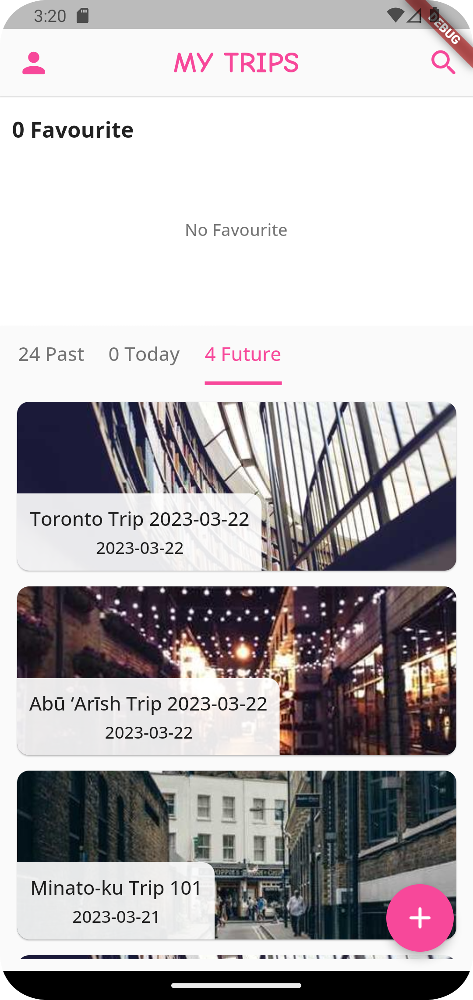
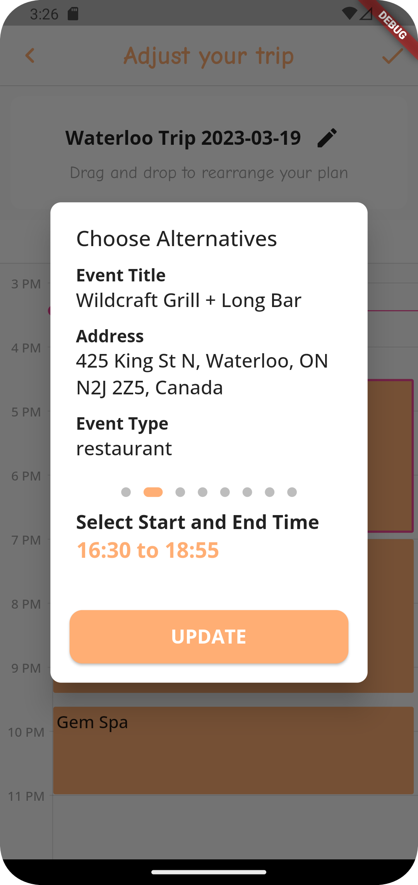

# Leisurely-frontend

### Introduction
This is the frontend of Leisurely. Leisurely is an itinerary day-trip planner app that generate an at most one day trip plan that matches user preference.

The frontend is built on the multi-platform framework Flutter. 

 

### App Sample Pages (not all)
Here is the home page and user profile page. 

  
  

User could create a new trip following four steps, choosing "Where", "When", "Budget" and "Activities" as shown below:

  
  

The app will automatically generated the trip for user based on choice and user could adjust the trip plan, changing time, choosing alternative events etc.

  
  
  

Clicking on the check button on the right top to confirm the trip, the final trip plan is now saved, and user could check it from the home page. User could edit, favorite, or delete the trip plan.  

  
  

